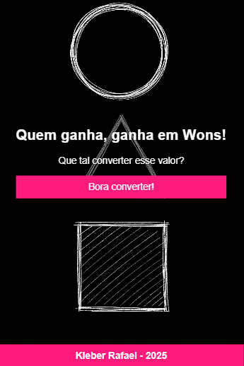
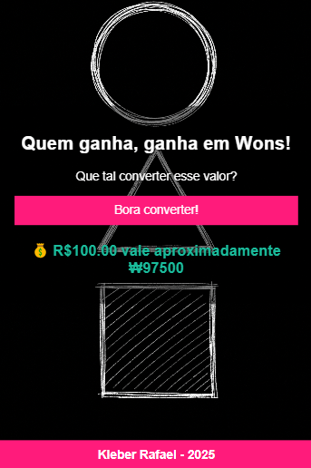
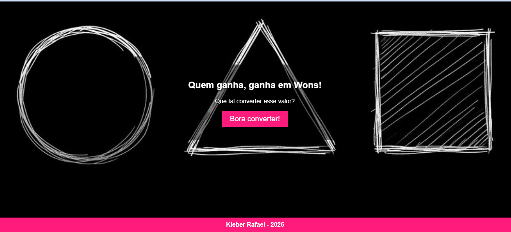

<h1 align="center"> Conversor de Wons </h1>

Projeto desenvolvido durante a imersão Dev 9ª Edição da Alura com foco em interatividade e responsividade.

  <a href="#-tecnologias">Tecnologias</a>&nbsp;&nbsp;&nbsp;|&nbsp;&nbsp;&nbsp;
  <a href="#-projeto">Projeto</a>&nbsp;&nbsp;&nbsp;|&nbsp;&nbsp;&nbsp;
  <a href="#-layout">Layout</a>&nbsp;&nbsp;&nbsp;|&nbsp;&nbsp;&nbsp;
  <a href="#-funcionalidades">Funcionalidades</a>

  

 

  

## 🚀 Tecnologias

Esse projeto foi desenvolvido com as seguintes tecnologias:

- HTML5
- CSS3
- JavaScript
- Git e Github

## 💻 Projeto

O **Conversor de Wons** é uma aplicação web que simula a conversão de valores em reais para wons sul-coreanos.  
O projeto conta com responsividade para dispositivos móveis, efeitos de transição e um design atrativo.

## 🎨 Layout

Você pode personalizar o layout modificando os arquivos de estilo dentro da pasta `assets` e o arquivo `style.css`.

## ⚙️ Funcionalidades

- Tela inicial com imagem de fundo responsiva
- Animação de entrada dos elementos
- Botão para iniciar a conversão
- Input dinâmico que aparece ao clicar no botão
- Exibição do resultado convertido em won
- Reinício da interface ao clicar novamente
- Favicon personalizado
- Design adaptado para mobile e desktop

## 📱 Telas

  
  

  

## :memo: Licença

Esse projeto está sob a licença MIT.

---

Feito com 💖 por Kleber Rafael 🚀
